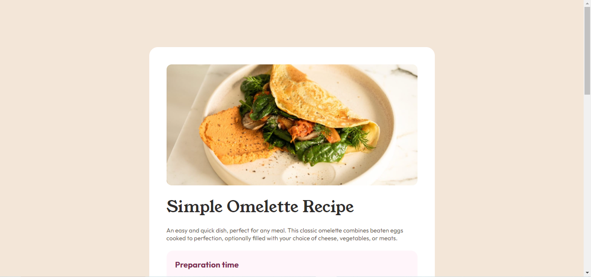

# Frontend Mentor - solução de Página de receita

Esta é uma solução para o [Desafio da página de receitas no Frontend Mentor](https://www.frontendmentor.io/challenges/recipe-page-KiTsR8QQKm).
Os desafios do Frontend Mentor ajudam você a melhorar suas habilidades de codificação através da construção de projetos realistas.

### Screenshot

### Construído com

- Marcação HTML5 semântica
- Caixa flexível
- Grade CSS

